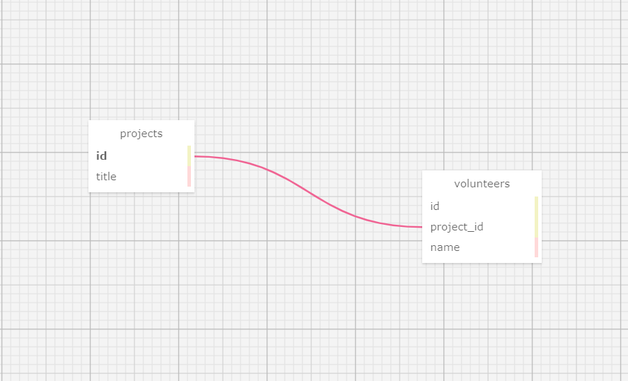

### By:
Isaac Overstreet Epicocdus Oct 2021 full time cohort

## Description:
This application is used for showing projects that the user adds and also adding volunteers to each project to track who is on what project.

## Technologies Used
* Bootstrap
* Ruby
* Docker
* Sinatra
* rspec
* pry
* postgres
* psql
* capybara

## Setup/Installation Requirements
* Navigate to https://github.com/mrunderoad/rubywk3 and clone the repo onto your local machine.
* Open the project in VS code.
* (DOCKER)
* Run `docker-compose up` to get port number. example=port=4567
Start a live server and in the URL bar type in the port number it gives you from the previous step.
Next, click on localhost:4567(or whatever number it gives you) in your session details to view project!
* Run `docker-compose run --rm web bundle exec rspec` to view test specs for unit testing and integration testing.
* (Mac)
* Run `ruby app.rb` in your terminal to open a localhost page to view application.
* Run `rspec` to run tests
* ENJOY!

#### Database steps
* `bundle` the gems
* run `postgres`
* to create the DB run `createdb volunteer_tracker`
* run `psql volunteer_tracker < database_backup.sql` to backup database
* run `rspec` in a new terminal to view tests
* `ruby app.rb` to launch live server. enter in local server port number into browser -- localhost:0000 (your port will replace the 0000)
* (docker)
* `docker-compose run db` to start db container, then run `docker ps` to get container ID.
* Next, run `docker exec -it -u postgres [container id] psql` to start psql
* Then run `CREATE DATABASE volunteer_tracker;` to create db
* then `CREATE DATABASE volunteer_tracker_test;` for test database
* run `docker-compose run --rm web bundle exec rspec` to run tests
* to get local server run `docker-compose up --build`
* open browser and enter in local host port the same as the not docker way.

## Database Schema

## Known Bugs
No known bugs at this time.

### License
MIT licensing @https://opensource.org/licenses/MIT

Copyright (c) 1/9/2022 Isaac Overstreet
